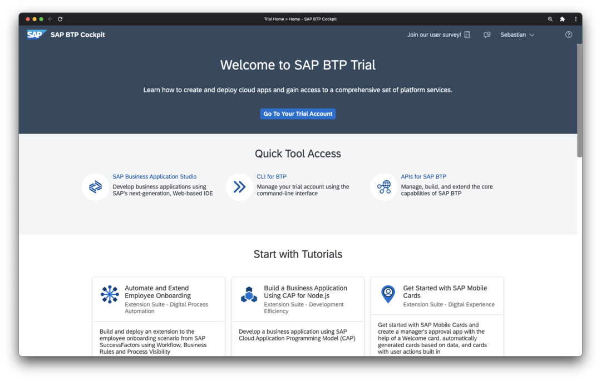
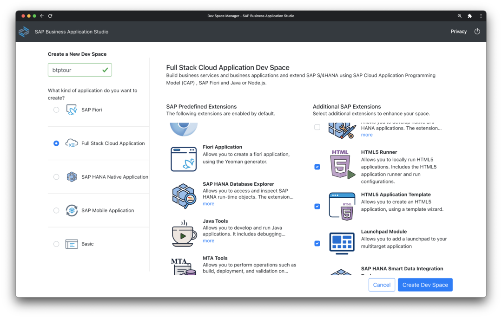
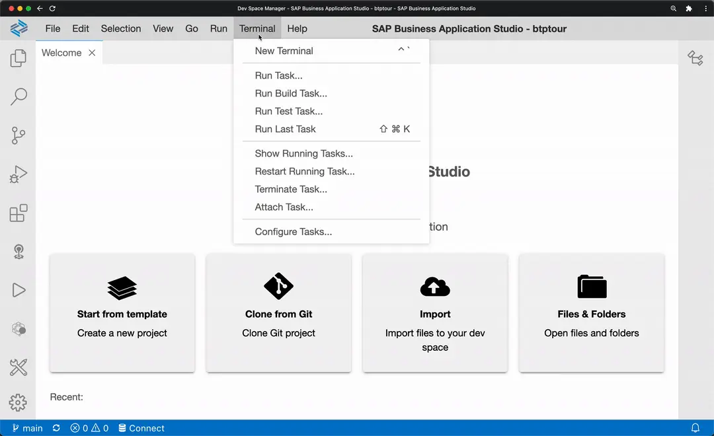
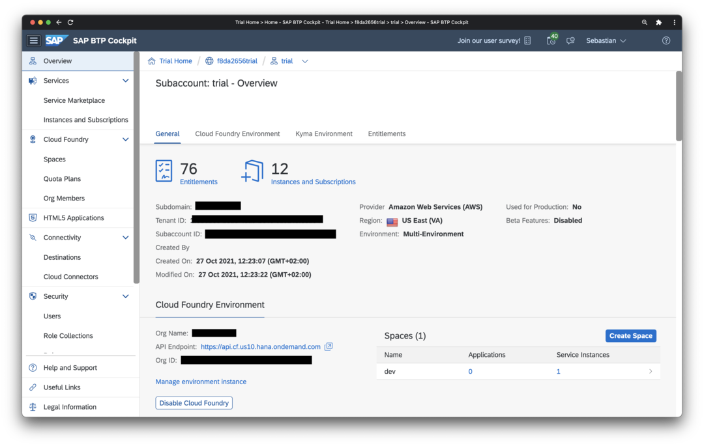
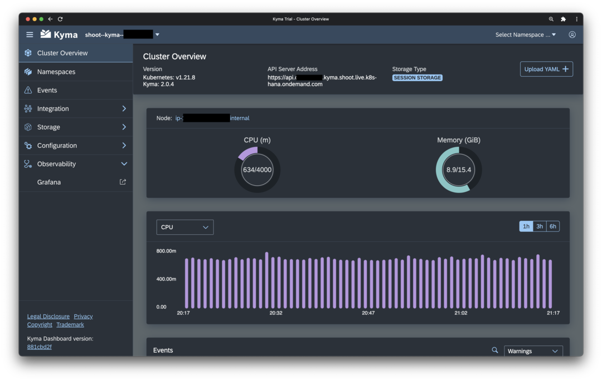

# Create a new dev space

- Go to your [BTP Trial account](https://hanatrial.ondemand.com){target=_blank}
    
- Chose *SAP Business Application Studio* in *Quick Access*
- Select `Create Dev Space`
- Choose a name, select the profile *Full Stack Cloud Application*, and add additional extensions like *HTML5 Runner*, *HTML5 Application Template*, *Launchpad Module*, and *Workflow Management*
    
- When the dev space is finally ready, click on the name to enter the Business Application Studio (BAS)

# Install the command line tool for Kyma

The built-in *terminal* of BAS provides a convenient option for running a great variety of command line tools often needed for building, testing and managing code as well as interacting with cloud platforms like SAP BTP, Azure, AWS, or Google Cloud.

In the BTP Tour we will use the terminal to configure and control our Kubernetes/Kyma cluster in the BTP Trial environment.



- Open a command line in BAS via `Terminal > New Terminal`


- Download and install the Kubernetes command line tool `kubectl`:

```bash
mkdir -p ~/local/bin
cd ~/local/bin
curl -LO "https://dl.k8s.io/release/$(curl -L -s https://dl.k8s.io/release/stable.txt)/bin/linux/amd64/kubectl"
chmod u+x kubectl
```

- Create a new file `.bash_aliases` and add the following:

```bash
 if [ -d "$HOME/local/bin" ]; then
  PATH="$HOME/local/bin:$PATH"
 fi
```

- Start a new Terminal and verify everything is working:

```bash
kubectl version
```

!!! note
    The `kubectl version` command should print out details like client version, platform etc. At this point, there is no need to worry if the command also prints an error message like `Error from server (NotFound): the server could not find the requested resource`. The tool simply states here that it cannot connect to a Kubernetes cluster for displaying further information. This will be addressed in the following.

# Setup access to Kyma Cluster

- Go to BTP Trial account https://hanatrial.ondemand.com
- Chose *Go To Your Trial Account* and enter the *trial* subaccount in BTP Cockpit
    
- Go to *Kyma Environment > Link to dashboard*
- Download the Kyma access configuration via the *Profile* icon in the top right and select *Get Kubeconfig*
    
- In BAS, make sure your home directory is opened (*Open > /home/user*) and no subfolder is selected in the file explorer. The upload the file *kubeconfig.yml* via *File > Upload Files*
- Add the following line to `.bash_aliases` and add the following line:

```bash
export KUBECONFIG=$HOME/kubeconfig.yml
```

- Start a new Terminal and verify everything is working:

    ```bash
    kubectl version
    ```

!!! warning
    For security reasons, the downloaded personal Kyma access configuration expires after 8 hours. After expiry, download a fresh *kubeconfig.yml* from your Kyma account and upload it again (steps 4 and 5).


# Configure access for github.com

- Go to your [Github account](https://github.com) and sign up for a new personal account if necessary
- Create new Personal Access Token (PAT) in Github (Profile > Settings > Developer settings > Personal access tokens) with scope `repo` and copy the generated token.
- Open a command line in BAS via `Terminal > New Terminal`
- Clone your fork of the *BTP Tour* repository

```bash
git clone https://github.com/YOUR_GITHUB_NAME/btptour.git
```

!!! hint
    Do not forget to replace *YOUR_GITHUB_NAME* in the command with your Github account name!

This will open a username/password field at the top of the screen of BAS.

- Enter you email address as username and the generated token as password.

    Choose `Save as plaintext on the dev space for future use`.
