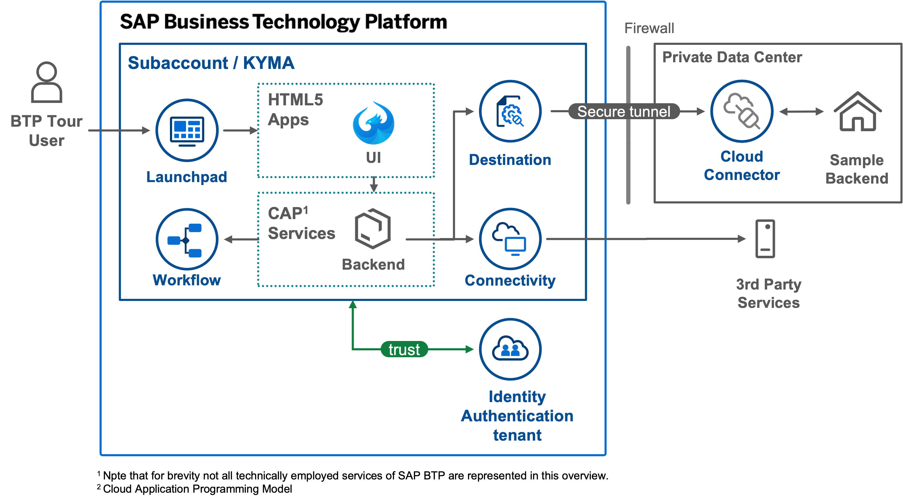

# Welcome to the BTP Tour

The *BTP Tour* is a guided exploration of the *SAP Business Technology Platform* (*BTP*), for everyone who is interested in developing a basic understanding of some of the key concepts and get some direct hands-on experience to see the BTP in action.

!!! warning "Disclaimer"
    The *BTP Tour* is a personal project with the aim to organize and share my own experience and help others to develop their own mental model of SAP's Business Technology Platform. Opinions expressed are solely my own and do not express the views or opinions of SAP.

	In particular, the *BTP Tour* must not be confused with an official SAP resource. All information is provided *as is* without any claims or guarantees regarding completeness, correctness, or being up-to-date to the latest official SAP guidelines and recommendations. Accordingly, one should not base any commercial decisions on the materials provided in the *BTP Tour*. Please reach out to official SAP channels for respective guidance and commercial support.

	Last but not least, please note that the *BTP Tour* is designed for educational purposes. Hence, materials and code examples are intentionally reduced to illustrate concepts and do not necessarily correspond with recommended best practices for implementing secure, productive applications.

## Tour Overview

The *BTP Tour* introduces BTP principles in form of a small sample scenario as illustrated in the [solution diagram](https://wiki.scn.sap.com/wiki/x/shl7H){target=\_blank} below. Over the course of the tour, we will not only establish an understanding of the various concepts, services, and relationships depicted in the solution diagram. We will also shed some light on how these artifacts surface to developers and cloud operators, and put all this in context with widely-cited cloud principles like
*observability*, *continous integration and deployment* (*CI/CD*), *infrastructure as code*, or *relentless automation*.

